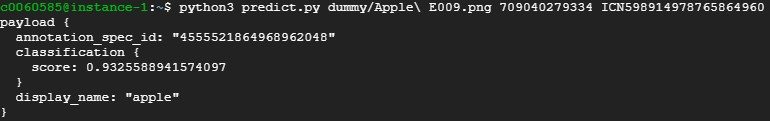
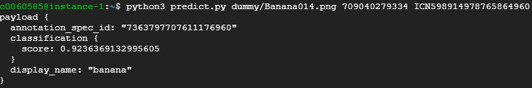
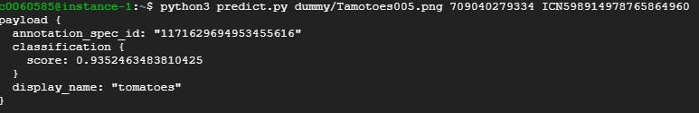

# SMART FRUIT

## What i do
I create machine learning model from AutoML, then serve the result in web.

The model is pretty good, some ss from testing model

The problem is how to serve the payload in web app and user can insert input themself. So, I create a web, the end-point given below.

The web using flask.
## end-point

http://34.101.195.222/