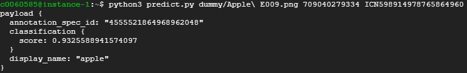
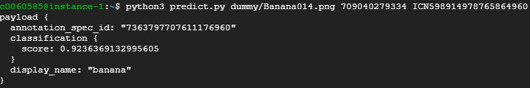
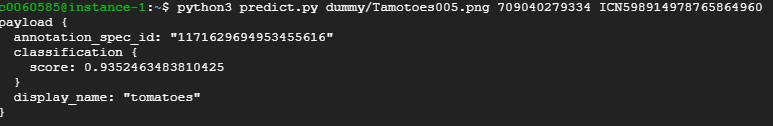

# SMART FRUIT

# what i do
I make model from AutoML, then serve the result in flask

the model is pretty good, some ss from testing model

the problem is how to serve the payload in web app and user can insert input themself. So, I make app engine, the end-point given below.

# end-point
https://flask-vision.uc.r.appspot.com/

still have error.